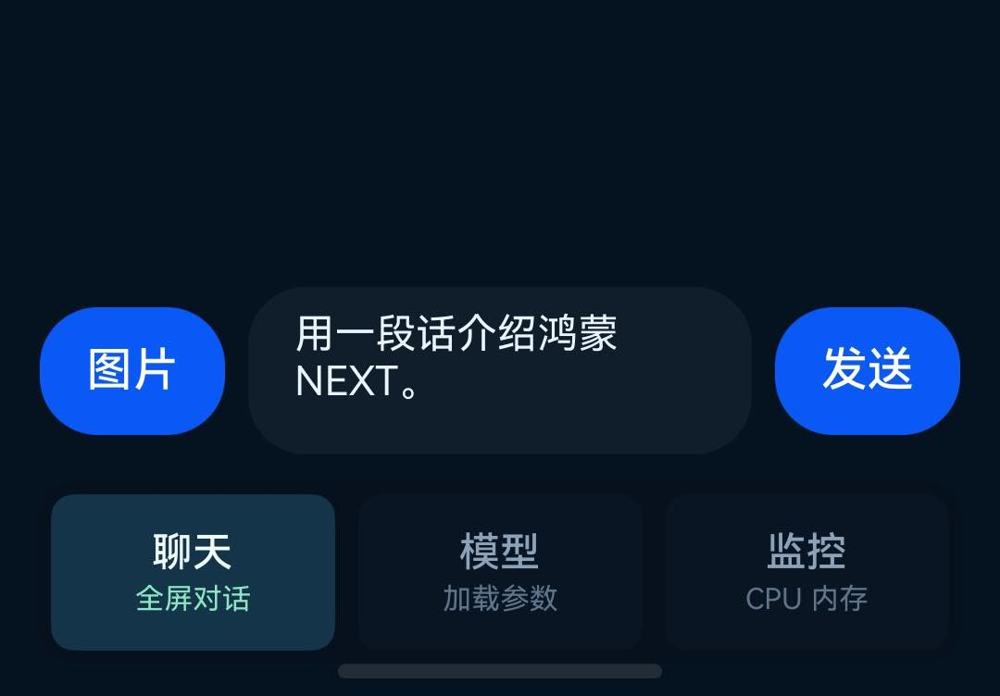

# Turbo AI Chat

[English](README_EN.md) | 中文


**Turbo AI Chat** 是一个 HarmonyOS NEXT 原生本地大模型聊天 Demo。它用 ArkTS 构建界面，通过 N-API 调用 C++ 原生推理层，并使用 MNN Runtime 在鸿蒙设备端加载 **Gemma 4** MNN 模型完成离线对话。

关键词：HarmonyOS NEXT, HarmonyOS native LLM, ArkTS, N-API, MNN, Gemma 4, on-device AI, local LLM, mobile inference, Hugging Face model.

## 项目背景

这个项目来自一次很直接的验证：**鸿蒙 NEXT 能不能在原生 App 里跑本地大模型？**

早期方向是找 GGUF / llama.cpp 在鸿蒙上的案例，但实测下来，面向鸿蒙原生工程更稳的路线是 MNN：它有移动端推理能力，也已经有 Gemma 4 的 MNN 导出模型。于是这个仓库先把目标收敛到一件事：

> 在 HarmonyOS NEXT 真机上，用原生 App 加载本地 Gemma 4 模型，并完成可交互、可流式输出的聊天。

当前版本不是云端聊天壳子，也不是 WebView；模型文件在设备本地，推理由 App 内的原生层完成。

## 功能

- HarmonyOS NEXT 原生 ArkTS UI
- C++ / N-API 推理桥接
- MNN LLM Runtime 设备端推理
- Gemma 4 MNN 模型加载
- 流式输出
- 多轮上下文记忆
- 图片选择入口
- CPU / 内存状态展示
- 启动后自动弹窗加载模型
- 中文界面、沉浸式布局、底部 Tab

## 截图

| 聊天界面 | 顶部状态 | 输入区 |
| --- | --- | --- |
|  |  |  |

## 当前模型格式说明

这个项目当前主线使用的是 **MNN 模型目录**，不是直接加载 `.gguf`。

推荐模型：

- Hugging Face: [`taobao-mnn/gemma-4-E2B-it-MNN`](https://huggingface.co/taobao-mnn/gemma-4-E2B-it-MNN)
- 模型类型：Gemma 4 E2B instruction，MNN 4-bit 量化导出
- 主要入口文件：`config.json`

模型目录需要包含这些文件：

```text
gemma-4-E2B-it-MNN/
  config.json
  llm_config.json
  tokenizer.mtok
  llm.mnn
  llm.mnn.weight
  ple_embeddings_int4.bin
  visual.mnn
  visual.mnn.weight
  audio.mnn
  audio.mnn.weight
```

如果你手里是 GGUF，需要先走转换或另接 llama.cpp 鸿蒙移植层；这个仓库当前没有直接读取 GGUF。

## 直接下载 HAP

Release 会附带可安装的 HAP：

- [Latest Release](https://github.com/Turbo1123/turbo-ai-chat-harmonyos/releases/latest)

安装示例：

```sh
hdc install -r turbo-ai-chat-harmonyos-v0.1.0-signed.hap
```

HAP 不内置 5GB+ 模型文件。安装 App 后，还需要把模型目录放到 App 文件目录。

说明：Release 中的 HAP 是调试签名包。如果你的设备不在签名 profile 内，安装可能失败；这种情况下请从源码打开项目，并在 DevEco Studio 中使用自己的账号开启自动签名后重新构建。

## 下载模型

仓库提供了 Hugging Face 下载脚本：

```sh
./scripts/download_gemma4_e2b_mnn.sh
```

默认下载到：

```text
models/gemma-4-E2B-it-MNN/
```

也可以指定目录：

```sh
./scripts/download_gemma4_e2b_mnn.sh /path/to/gemma-4-E2B-it-MNN
```

如果没有 `huggingface-cli`，脚本会使用 Python 的 `huggingface_hub`。缺依赖时先安装：

```sh
python3 -m pip install huggingface_hub
```

## 模型放到手机哪里

App 默认读取这个路径：

```text
/data/storage/el2/base/haps/entry/files/gemma-4-E2B-it-MNN/config.json
```

这是 App 内看到的沙箱路径。使用 `hdc file send` 时，通常需要推到物理路径：

```text
/data/app/el2/100/base/com.example.gemma4mnn/haps/entry/files/gemma-4-E2B-it-MNN/
```

推荐使用脚本：

```sh
./scripts/push_model_to_device.sh
```

如果你的设备不是默认用户 `100`，可以指定：

```sh
USER_ID=100 ./scripts/push_model_to_device.sh
```

指定设备：

```sh
HDC_TARGET=<device-id> ./scripts/push_model_to_device.sh
```

手动推送示例：

```sh
hdc shell "mkdir -p /data/app/el2/100/base/com.example.gemma4mnn/haps/entry/files"
hdc file send models/gemma-4-E2B-it-MNN /data/app/el2/100/base/com.example.gemma4mnn/haps/entry/files/
```

## 从源码构建

环境要求：

- DevEco Studio / HarmonyOS SDK
- HarmonyOS NEXT 真机
- 已开启开发者选项和 USB 调试
- Huawei 开发者账号，用于自动签名
- `hdc` 和 `hvigor` 在 `PATH` 中

构建：

```sh
hvigor assembleApp --no-daemon
```

安装：

```sh
hdc list targets
hdc install -r entry/build/default/outputs/default/entry-default-signed.hap
```

如果你的本机还没有签名配置，请在 DevEco Studio 中：

1. 登录 Huawei 开发者账号。
2. 打开项目。
3. 进入 `File > Project Structure > Signing Configs`。
4. 为默认产品开启自动签名。
5. 重新构建。

`build-profile.json5` 中不会提交真实签名材料、证书路径和密码。

## MNN Runtime

仓库包含当前 Demo 使用的 Harmony arm64 `libMNN.so` 和最小头文件，方便直接构建。

如果你想从 MNN 源码重新构建：

```sh
git clone https://github.com/alibaba/MNN.git ../MNN
./scripts/build_mnn_ohos.sh
./scripts/stage_mnn_ohos.sh
```

`stage_mnn_ohos.sh` 会把产物放到：

```text
entry/src/main/libs/arm64-v8a/libMNN.so
third_party/mnn/include/
```

## 原生接口

ArkTS 通过：

```ts
import entry from 'libentry.so';
```

调用 N-API：

```ts
entry.loadModelAsync(configPath, threadNum, maxNewTokens): Promise<string>
entry.generateChatStream(messages, maxNewTokens, onChunk): Promise<string>
entry.reset(): void
entry.isLoaded(): boolean
```

## Roadmap

- 内置模型下载管理器
- 图片输入接入 Gemma 4 多模态能力
- 更细的 token / 首字延迟 / tokens per second 指标
- release 构建流水线
- GGUF / llama.cpp 路线对比和实验分支

## License

Apache-2.0. MNN 和模型文件遵循各自上游许可证；本仓库不提交大模型权重。
