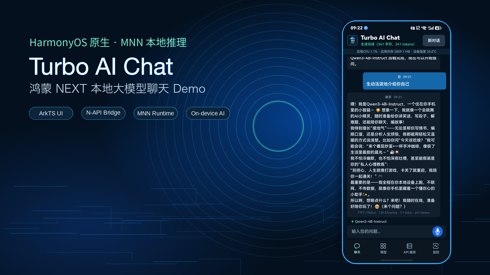
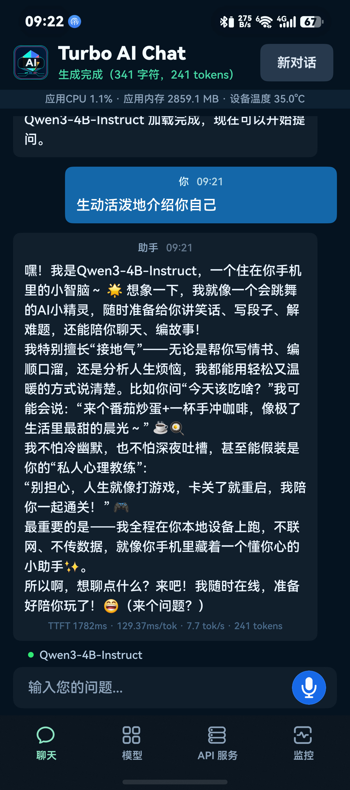
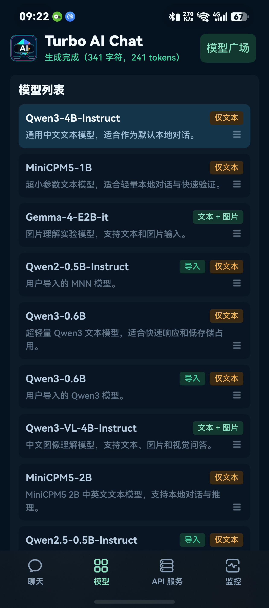
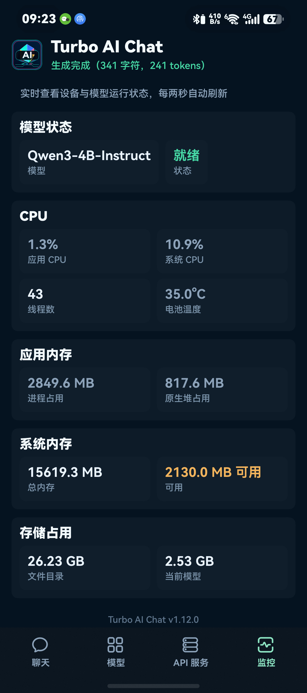
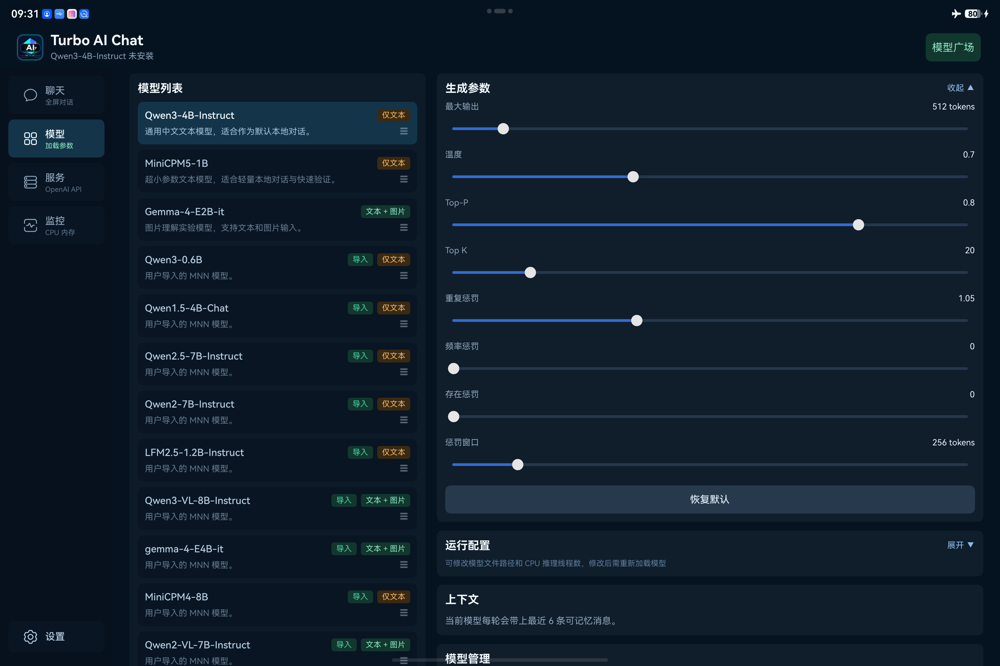
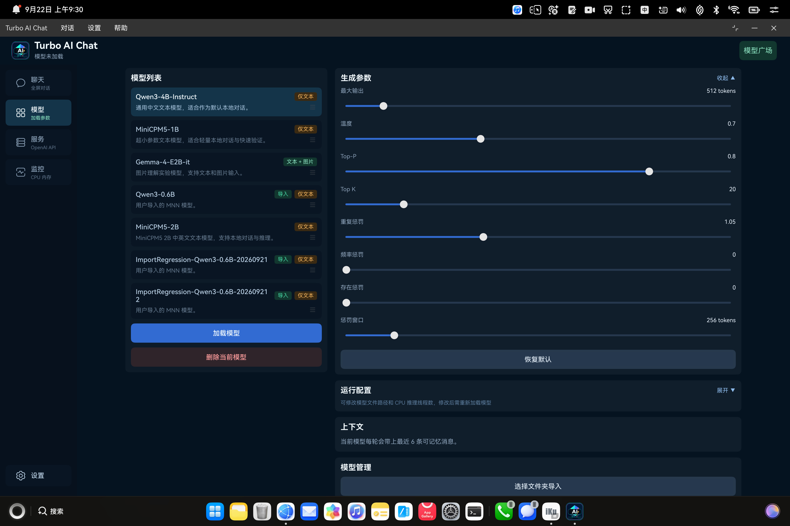

# Turbo AI Chat

[English](README_EN.md) | 中文




**Turbo AI Chat 是一个 HarmonyOS NEXT 原生端侧大模型聊天应用**，用于验证在鸿蒙设备上直接运行本地 LLM 的完整链路。项目基于 ArkTS、C++ N-API 和 MNN Runtime 构建，预置 Qwen3-4B-Instruct、MiniCPM5-1B 和 Gemma-4-E2B-it，并可通过模型广场或本地导入扩展兼容的文本与多模态 MNN 模型；同时提供流式对话、模型切换、图片理解、运行监控和局域网 OpenAI 兼容 API。

## 目录

- [项目来源与演进](#项目来源与演进)
- [项目背景](#项目背景)
- [近期重要改进](#近期重要改进)
- [系统要求](#系统要求)
- [快速开始](#快速开始)
- [功能](#功能)
- [截图](#截图)
- [OpenAI 兼容 API 服务](#openai-兼容-api-服务)
- [模型管理](#模型管理)
- [模型格式说明](#模型格式说明)
- [推理后端与性能](#推理后端与性能)
- [架构](#架构)
- [原生接口](#原生接口)
- [许可证](#许可证)

## 项目来源与演进

本项目起步于 [Turbo1123/turbo-ai-chat-harmonyos](https://github.com/Turbo1123/turbo-ai-chat-harmonyos)。上游仓库最初的两个提交打通了 ArkTS → N-API → C++ → MNN 的端侧推理链路，实现了 Gemma 4 的文本生成、流式输出和多轮对话，为后续开发提供了可运行的基础。

在保留这条基础链路的同时，本仓库将原先面向 Gemma 4 的实现逐步扩展为可加载兼容 MNN 模型目录的通用推理能力，接入了从 ArkTS 到 MNN 的完整图片输入链路，并完善了生成控制、停止原因、token 统计、模型目录校验和生命周期管理。在应用层，项目继续加入模型切换与导入、在线模型广场、离线语音输入、运行监控、OpenAI 兼容局域网 API，以及多轮真机回归验证。

本仓库现已脱离原 fork network，由当前仓库独立维护，但仍完整保留上游提交历史、Apache-2.0 许可证和相关来源说明。上游基线、核心链路的演进过程及对应提交见[核心推理链演进说明](docs/architecture/core-inference-evolution.md)，文件修改声明见 [`MODIFICATIONS.md`](MODIFICATIONS.md)；完整代码差异可查看 [`f946a84...main`](https://github.com/Torry2022/turbo-ai-chat-harmonyos/compare/f946a842...main)。

## 项目背景

鸿蒙生态中，端侧 AI 推理目前主要依赖卓易通等 Android 兼容层运行安卓 App。Turbo AI Chat 用纯原生链路（ArkTS → N-API → MNN → CPU）验证了一条不同的路径：

- **架构原生**：推理层直接对接 HarmonyOS NDK，无 Android 兼容层转译开销
- **开箱可复现**：通过模型广场从 ModelScope 一键下载预置模型，不依赖 HuggingFace（国内网络友好）
- **工程可复用**：MNN Runtime 封装、流式输出管线、Markdown 渲染等模块可作为其他鸿蒙 AI 应用的集成参考
- **开发者友好**：hdc 一键查看原始推理日志（`raw_output_debug.txt`），包含 prompt、模型输出、采样参数和 token 统计，便于定位模型行为

  ```sh
  hdc shell "cat /data/app/el2/100/base/com.example.gemma4mnn/haps/entry/files/raw_output_debug.txt"
  ```

如果你正在探索「鸿蒙 + 本地 AI」的技术方案，这个项目提供了一个可验证的工程基线。

## 近期重要改进

**浅色模式与外观设置（v1.10.0）**

- 新增浅色模式，可在设置中选择深色、浅色或跟随系统，重启后保留选择；继续使用原有 Logo 和启动图。
- 宽窗口的设置入口位于侧栏底部，手机通过左上角 Logo 菜单进入；同步调整页面、弹窗、模型标签和指标状态色，以及顶栏和底部导航的衔接。
- 为 Tab 切换和设置等弹窗的开关加入过渡动画；宽窗口监控页的模型名称与状态分行显示，减少卡片下方空白。

**界面样式（v1.9.1）**

- 保留原有页面布局，统一按钮的主次配色、文字、尺寸和圆角，并调整输入框与参数滑块的样式。
- 优化轻量操作的点击区域，为代码块的复制按钮预留空间，修正模型广场刷新状态文字显示不全的问题。

**平板与 PC 适配**

- 按实际窗口宽度切换底部导航、紧凑侧栏和完整侧栏；模型、监控等页面在宽窗口下分栏显示。
- 支持外接键盘 Enter 发送、Shift+Enter 换行、Ctrl+N 新对话，以及 Esc 退出输入或关闭可取消弹窗；中文输入法选词优先。
- 调整启动背景和系统安全区、弹窗限宽、聊天阅读宽度与状态条位置，并支持鼠标拖动模型排序。

**模型与市场**

- 默认文本模型切换为 Qwen3-4B-Instruct，并支持在 App 内通过模型广场从 ModelScope 安装预置模型和更多 MNN 模型条目。
- 模型广场支持在线目录刷新和本地缓存回退；维护者更新 [`model-catalog/catalog.json`](model-catalog/catalog.json) 后，用户无需更换安装包即可获取兼容的新模型条目。
- Fork 或二次开发版本默认仍读取本仓库的在线目录；如需维护独立模型广场，应修改 [`ModelCatalogService.ets`](entry/src/main/ets/services/ModelCatalogService.ets) 中的 `REMOTE_MODEL_CATALOG_URL`，指向自己的 Raw 目录地址并重新构建 App。
- 模型广场下载支持停止后断点续传；关闭已停止的安装弹窗会清理未完成的临时下载文件，避免沙箱残留。
- 除 zip 导入外，支持将完整 MNN 模型目录推送到 App 沙箱后，在模型页一键扫描注册，适合绕过大 zip 导入失败的问题。
- 模型页支持排序、删除已安装模型目录，并在模型生成、加载、导入期间禁用相关控件，避免状态不一致。

**聊天体验**

- 模型流式输出过程中可中断生成；被停止的回答不会写入后续上下文。
- 新增离线普通话语音输入：输入框为空且未聚焦时显示麦克风，识别过程中实时回填文字并显示语音活动声波，结束后可编辑再发送。
- 缓存 Markdown 与思考块解析结果，优化流式输出中的 UTF-8 片段和表格列宽稳定性；用户查看历史消息时不会在生成结束后被自动拉回底部，并隐藏聊天列表滚动条。
- 聊天页新增设备状态条，可快速查看应用 CPU、应用内存和设备温度等运行状态，并按指标风险动态调整数值颜色。

**稳定性与调试**

- MNN Runtime 升级至 3.6.0，并同步更新 HarmonyOS `arm64-v8a` 动态库与公开头文件。
- 模型加载、市场安装和本地导入统一执行目录预检，在进入原生推理前检查配置、权重引用、视觉文件和对话模板兼容性。
- 图片推理使用模型目录声明的视觉输入尺寸，兼容不同视觉网格配置的 MNN 多模态模型。
- 新增真机 `ohosTest` 回归基线，覆盖上下文、Markdown、思考块、模型兼容规则、导入命名和下载进度等关键逻辑。
- 监控页新增 App 存储占用、模型状态、版本/许可证信息和更紧凑的设备指标展示。
- 模型加载失败时会保留加载弹窗中的错误提示并清理推理状态，便于用户识别可用内存不足等加载问题后重试。
- 优化 Markdown 表格、列表、代码片段、思考块展示、原始输出日志和 MNN 对话模板处理，便于排查模型复读、停止符和模板问题。

**API 服务**

- 可将当前已加载的 MNN 模型作为局域网 OpenAI 兼容服务，供 Cherry Studio 等客户端调用。
- 支持 `/v1/models`、`/v1/chat/completions` 和 `/v1/responses`，包括 SSE 流式输出与可选 Bearer API Key。

## 系统要求

| 项目 | 建议配置 |
|------|----------|
| 系统 | HarmonyOS NEXT，项目当前 `compatibleSdkVersion` 为 `6.1.0(23)`，`targetSdkVersion` 为 `6.1.1(24)` |
| 设备 | ARM64 鸿蒙手机、平板或 PC（`phone` / `tablet` / `2in1`）。模拟器不作为本项目的本地 MNN 推理目标 |
| 运存 | 建议 8 GB 及以上运行 Qwen3-4B-Instruct / Gemma-4-E2B-it；MiniCPM5-1B 可作为较低内存设备的轻量验证模型 |
| 存储 | HAP 体积较小，模型权重占用为主要部分；单个 MNN 模型目录通常需要数 GB 存储空间 |
| 网络 | App 内模型广场从 ModelScope 下载模型，首次安装模型需要可访问 ModelScope 的网络环境 |

## 快速开始

### 1. 克隆并构建

```sh
git clone https://github.com/Torry2022/turbo-ai-chat-harmonyos.git
cd turbo-ai-chat-harmonyos
```

用 DevEco Studio 打开项目，登录华为开发者账号，开启自动签名，然后运行到真机。或命令行：

```sh
node ./node_modules/@ohos/hvigor/bin/hvigor.js assembleHap --no-daemon
hdc install -r entry/build/default/outputs/default/entry-default-signed.hap
```

### 2. 安装模型

App 和 HAP 均不内置模型权重。打开 App → 模型页 → 模型广场，或选 Qwen3-4B-Instruct、MiniCPM5-1B、Gemma-4-E2B-it 后点击加载，App 会引导从 ModelScope 下载到沙箱。

| 模型 | 大小 | 能力 |
|------|------|------|
| Qwen3-4B-Instruct | ~2.5 GB | 文本 |
| Gemma-4-E2B-it | ~3.7 GB | 文本 + 图片 |
| MiniCPM5-1B (BF16) | ~2.1 GB | 文本 |

### 3. 开始聊天

模型加载完成后回到聊天页，发送消息即可。Qwen3-4B-Instruct 是默认文本模型，MiniCPM5-1B 会展示思考块（`<think>`），Gemma-4-E2B-it 支持图片输入。

外接键盘在聊天输入框中使用 Enter 发送、Shift+Enter 换行；中文输入法选词优先由输入法处理。Ctrl+N 开始新对话，Esc 可退出输入或关闭可取消的弹窗，不会退出 App。软键盘仍通过发送按钮发送。宽窗口下聊天区域居中限宽，软键盘弹出时缩小内容区，保留顶栏和底部输入栏。

## 功能

- 外观：在设置中选择浅色模式、深色模式或跟随系统，选择会保留。宽窗口从侧栏底部进入设置，手机窄窗口点击左上角 Logo 菜单进入；两种模式使用相同布局、Logo 和启动图。
- 自适应导航：窄窗口使用底部标签栏，较宽窗口改为侧栏；窗口缩放不会重建各页面，监控页离开后暂停采样并保留滚动位置。
- 聊天运行状态条仅占页面内容区，不改变侧栏位置；宽屏聊天区与其他页面采用相同的最大宽度，单条消息另行限宽以便阅读。
- 模型页在宽窗口下并排显示模型列表与参数区；触屏长按拖动手柄排序，鼠标可直接拖动手柄。调整窗口尺寸会取消正在进行的拖拽，不会提交中途的排序。
- 监控页根据可用宽度切换单列或双列卡片，卡片内的指标自动分配剩余宽度。
- 弹窗按可用窗口限宽，长正文可滚动；模型广场在软键盘弹出时自动缩小。弹窗打开期间，键盘焦点不会进入底层页面。
- 本地推理：模型在设备端运行，无网络依赖
- 流式输出：以原生推理回调的 chunk 实时更新回答
- 停止生成：输出过程中可中断本轮回复
- 语音输入：通过 Core Speech Kit 离线识别普通话，实时显示中间结果并支持手动停止
- 模型切换：可在预置模型、已安装市场模型和导入模型之间切换
- 思考块：MiniCPM5-1B 展示推理思考过程
- Markdown 渲染：代码块（含复制按钮）、表格、引用、链接等，并针对流式输出中的未闭合行内代码、表格空单元格和表格列宽抖动做了兼容处理
- 长对话滚动优化：缓存 Markdown / 思考块解析结果，并在用户滚动查看时暂停自动跟随底部
- 生成参数调节：温度、Top-P/K、惩罚项等
- 性能指标：TTFT、TPOT、tokens/s 实时显示
- 模型管理：模型广场下载、调整模型排序、删除已安装模型目录
- 导入本地 MNN 模型：支持 zip 导入，也支持 hdc 推送目录后扫描注册；正式 MNN 导出目录优先使用 `llm_config.json` 中的 `jinja.chat_template`
- OpenAI 兼容 API：通过局域网向 Cherry Studio 等客户端提供当前已加载模型，支持流式输出和 Bearer 鉴权

## 截图

| 聊天界面                          | 模型界面                              | 监控界面                                |
|-------------------------------|-----------------------------------|-------------------------------------|
|  |  |  |

平板横屏：



PC 最大化：



## OpenAI 兼容 API 服务

模型加载完成后，进入“服务”页，设置端口并按需启用应用生成的 API Key 后启动服务。页面会显示形如 `http://192.168.1.126:8080` 的局域网地址。未加载模型时直接启动服务，App 会引导加载当前模型，并在加载成功后继续启动；释放、切换或删除当前模型时，正在运行的服务会自动停止。

在 Cherry Studio 中添加 OpenAI 兼容服务时，填写页面显示的根地址，不要手动追加具体端点；如已启用 API Key，再填写同一密钥，然后获取模型列表。服务提供以下端点：

- `GET /v1/models`
- `POST /v1/chat/completions`
- `POST /v1/responses`

服务页会显示服务启停、请求路径、模型参数、响应状态、耗时和输出规模等运行日志，不记录 API Key、提示词或回答正文。

宽窗口下，服务设置与 API 日志并排显示；缩窄窗口后恢复单栏，已启动的服务不会因布局切换而重启。

第一版仅支持文本输入和当前已加载模型，同一时间处理一个生成请求。对于带 `<think>` 的模型，`/v1/chat/completions` 会将思考过程放入 `reasoning_content`，`/v1/responses` 会返回独立的 reasoning 输出项，最终回答仍保留在常规文本字段中。当前 `usage` 仅能准确提供生成 token 总数，暂不提供输入与 reasoning 的精确分项计数。服务随 App 运行，App 退出后停止；设备与客户端需要处于可互相访问的同一局域网。

## 从 HAP 直接安装

[Releases](https://github.com/Torry2022/turbo-ai-chat-harmonyos/releases) 提供签名 HAP（仅限当前 profile 内设备）。使用 hdc 安装：

```sh
hdc install -r turbo-ai-chat-harmonyos-vX.Y.Z-signed.hap
```

也可通过[小白调试助手](https://github.com/likuai2010/auto-installer)侧载。调试签名包仅限当前 profile 内设备；其他设备请下载未签名包自行签名。

## 模型管理

推荐优先使用 App 内模型广场安装模型；如果模型包较大或需要调试本地转换结果，再使用 zip 导入或手动推送目录。

- **模型广场**：在模型页打开模型广场，可刷新在线目录并从 ModelScope 下载预置或扩展模型；网络失败时继续使用最近一次有效缓存或安装包内置目录。
- **导入 zip**：适合体积较小、结构完整的 MNN 模型目录压缩包。
- **手动推送目录**：适合大模型、离线调试或 zip 导入失败时使用，推送后在模型页扫描注册。

### 手动推送模型目录

App 内通过模型广场下载模型、App 内选择 zip 导入模型是推荐方式。以下 `hdc` 推送仅作调试备用。

推送的模型目录必须是 **MNN 格式**，即通过 MNN `llmexport.py` 从 HuggingFace 权重导出的目录，包含 `config.json`、`llm_config.json`、tokenizer 文件、`llm.mnn`、`llm.mnn.weight` 等。原始 HuggingFace safetensors、GGUF、MLX 权重不能直接使用。

#### 内置模型目录备用推送

以下命令用于补齐 App 已内置在模型列表中的模型目录，是 App 内下载失败或离线调试时的备用方案。

```sh
cd models
hdc file send -b com.example.gemma4mnn gemma-4-E2B-it-MNN /data/storage/el2/base/haps/entry/files/
hdc file send -b com.example.gemma4mnn MiniCPM5-1B-MNN /data/storage/el2/base/haps/entry/files/
hdc file send -b com.example.gemma4mnn Qwen3-4B-Instruct-2507-MNN /data/storage/el2/base/haps/entry/files/
```

> `-b` 指定 bundle 名称，是写入 App 沙箱的必需参数。

#### 导入模型目录手动推送

如果 App 内导入大 zip 包失败，可以绕过 zip 解压，直接用 `hdc` 推送 MNN 模型目录，并在 App 内扫描注册。

**要注册为导入模型**：

1. 准备一个完整的 MNN 模型目录。目录中应包含 `config.json`、`llm_config.json`、`llm.mnn`、`llm.mnn.weight`、tokenizer 文件等。
2. 建议把该目录放到仓库的 `models/` 目录下，例如 `models/Qwen3-4B-Instruct-2507-MNN`。
3. 从模型目录的父目录执行推送命令：

   ```sh
   cd models
   hdc file send -b com.example.gemma4mnn Qwen3-4B-Instruct-2507-MNN /data/storage/el2/base/haps/entry/files/model-imports/
   ```

4. 查看真机沙箱中的目录结构，确认关键文件完整：

   ```sh
   hdc shell "ls -la /data/app/el2/100/base/com.example.gemma4mnn/haps/entry/files/model-imports/Qwen3-4B-Instruct-2507-MNN"
   ```

   目录中应能看到 `config.json`、`llm_config.json`、`llm.mnn`、`llm.mnn.weight` 和 tokenizer 文件。

5. 打开 App → 模型页 → 展开“模型管理”。
6. 点击“扫描已推送目录”。App 会自动查找 `config.json`、`.mnn` 文件和可识别的对话模板，生成导入模型配置并保存到 `model-imports/imported-models.json`。
7. 在模型列表中选择新增的导入模型并加载。

无论通过 zip 还是目录扫描导入，App 都会读取 `llm_config.json` 中的 `is_visual` 自动识别图片能力；自动生成短名称时会尽量保留 `0.6B`、`1.8B` 等参数量信息。

扫描只识别 `model-imports/` 下的一级子目录；目录名不要包含 `/`、`\` 或 `..`。在 Windows 终端中建议从模型目录的父目录执行 `hdc file send`，避免把更多上级路径或反斜杠写入 App 沙箱。若你的模型不在仓库 `models/` 下，也可以 `cd` 到该模型目录的父目录后再推送。

App 会统一检查 MNN 模型目录的对话模板：模型广场下载、预置模型安装和导入模型扫描都会优先使用 `llm_config.json` 中已有的 `jinja.chat_template`；如果缺少该字段，App 仅额外兼容可自动识别的旧 ChatML 模板，否则会跳过该目录并提示模板不兼容。

## PC 侧下载模型脚本

```sh
# Qwen3-4B-Instruct（约 2.5 GB）
./scripts/download_qwen3_4b_mnn.sh

# Gemma-4-E2B-it（约 3.7 GB）
./scripts/download_gemma4_e2b_mnn.sh

# MiniCPM5-1B BF16（约 2.1 GB）
./scripts/download_minicpm5_1b_mnn.sh
```

指定输出目录：

```sh
./scripts/download_minicpm5_1b_mnn.sh /path/to/MiniCPM5-1B-MNN
```

需要 Python modelscope 包：`pip install modelscope`。

## 模型格式说明

App 使用 **MNN 模型目录**格式。内置模型当前从 ModelScope 下载：Qwen3-4B-Instruct 和 Gemma-4-E2B-it 来自 [MNN 官方](https://modelscope.cn/organization/MNN)，MiniCPM5-1B BF16 来自 [TorryJi](https://modelscope.cn/models/TorryJi/MiniCPM5-1B-MNN-BF16)。原始 HuggingFace 权重需要经 MNN `llmexport.py` 转换后才能使用。

## 推理后端与性能

当前版本使用 **MNN CPU 后端**进行本地推理，尚未接入 GPU / NPU 后端。模型页中的“推理线程”会传入 native 层作为 MNN CPU 推理线程数，默认值为 6。

端侧 LLM 解码包含 token-by-token 的串行阶段，实际吞吐还会受到内存带宽、缓存争用和系统温控影响。聊天气泡中的 TTFT 表示从发送请求到收到首个完整 UTF-8 输出 chunk 的端到端耗时；TPOT 和 tokens/s 仅按首个输出到生成结束之间的解码阶段计算，并使用原生层返回的输出 token 数。评估推理性能时，建议同时结合应用 CPU、应用内存和设备温度观察整体运行状态。

## 架构

```text
ChatTab / ModelTab / MonitorTab / ...
                |
          ChatViewModel
      |-- GenerationWorkflow -- ImagePayloadService
      |-- ModelLifecycleService -- 目录预检 / 安装 / 导入 / 扫描
      `-- NativeInferenceService（由上述工作流共享）
                |
        N-API Bridge (libentry.so)
                |
     MnnLlmRunner (mnn_llm_runner.cpp)
        |          |           |
      文本      原始 Prompt    图片
                |
       MNN Runtime (libMNN.so)
                |
           CPU Backend
```

`MnnLlmRunner` 负责兼容 MNN `Transformer::Llm` 目录的 native 推理。模型安装、导入和目录预检由 ArkTS 生命周期服务处理，文本、原始 Prompt 和图片生成共享稳定的 N-API 边界。详细演进见[核心推理链演进说明](docs/architecture/core-inference-evolution.md)。

## 原生接口

ArkTS 通过 `import entry from 'libentry.so'` 调用 N-API：

```ts
entry.loadModelAsync(configPath, threadNum, maxNewTokens, settings): Promise<string>
entry.generateRawPromptStream(prompt, maxNewTokens, endWith, settings, onChunk): Promise<GenerationResult>
entry.generateChatStream(messages, maxNewTokens, settings, onChunk): Promise<GenerationResult>
entry.generateImageChatStream(messages, pixels, width, height, maxNewTokens, settings, onChunk): Promise<GenerationResult>
entry.stopGeneration(): void
entry.reset(): void
entry.isLoaded(): boolean
```

## 许可证

本仓库源码使用 Apache-2.0 许可证。

MNN Runtime 和模型权重遵循各自上游许可证或模型卡说明。本仓库和 Release HAP 均不提交模型权重，用户通过模型广场、脚本或手动推送获得的模型文件需自行遵守对应来源的使用条款。

- [MNN](https://github.com/alibaba/MNN)
- [Qwen3-4B-Instruct-2507-MNN](https://modelscope.cn/models/MNN/Qwen3-4B-Instruct-2507-MNN)
- [Gemma-4-E2B-it-MNN](https://modelscope.cn/models/MNN/Gemma-4-E2B-it-MNN)
- [MiniCPM5-1B-MNN-BF16](https://modelscope.cn/models/TorryJi/MiniCPM5-1B-MNN-BF16)
